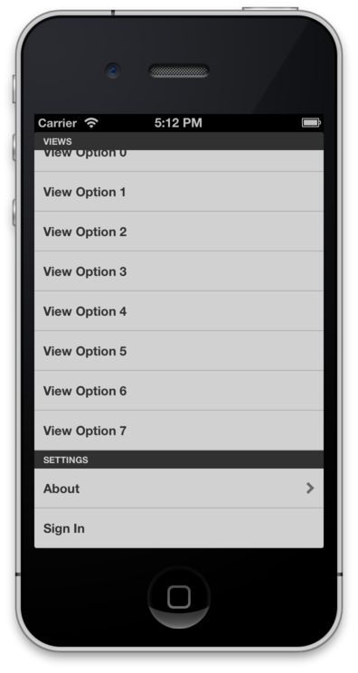

# MNStaticTableViewController

MNStaticTableViewController is a utility `UITableViewController` subclass that tries to make constructing static sectioned lists, like menus or side panels, easier.

## Installation

Using CocoaPods:

```pod 'MNStaticTableViewController', :tag => '<repo-tag>'```

Where `repo-tag` is the tagged version of the project you wanto depend on.

If you want to sit straight on this repository:

``` pod 'MNStaticTableViewController', :git => 'https://github.com/madninja/MNStaticTableViewController.git'```

## Usage 

Create an instance of `MNStaticTableViewController` and pass it an array of instances of 'MNStaticTableViewProviders' subclasses that provide cells and actions for each section of the tableview.

To bundle a menu implementation together you can encapsulate all of this in a single subclass of `MNStaticTableViewController` as shown in the demo project. 

See the demo project on how to create providers for each section



## License

BSD Licensed.  See the LICENSE file for details. 